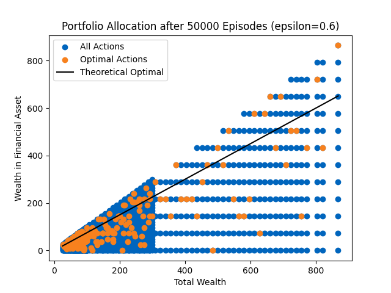
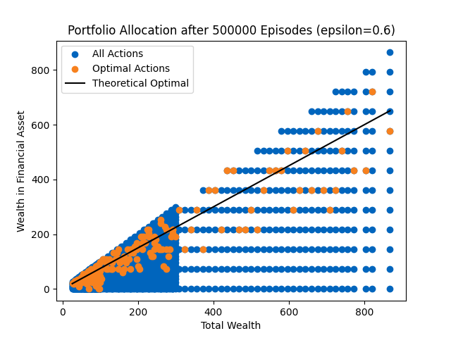
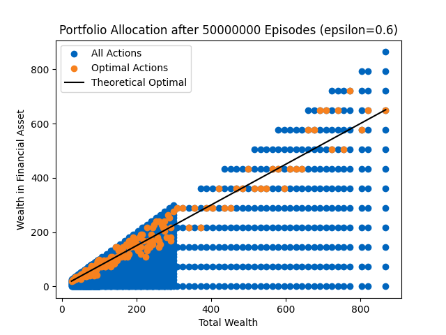
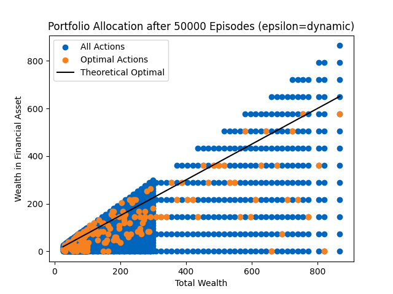
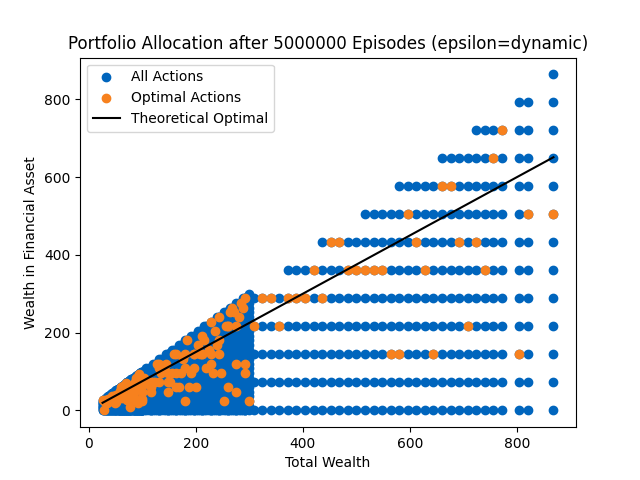

# Q-Learning for Optimal Investment

A tabular Q-learning agent that learns how much of its wealth to invest in a risky asset, implemented from scratch with NumPy.

Written for **Mathematics of Reinforcement Learning** at the **Technical University of Munich** (Prof. Dr. Christoph Knochenhauer), winter term 2024/25.

## Problem

The market is a Cox–Ross–Rubinstein (CRR) binomial model over T = 3 periods.

- **Risky asset:** starts at price P₀ = 8. Each period its price rises by 200% (u = 2) or falls by 50% (d = −0.5), each with probability q = 0.5.
- **Starting point:** the investor starts with wealth 100. At each time step they choose how much wealth to put into the asset, in whole units of the asset.
- **Objective:** maximise the expected log-utility of terminal wealth, log(W_T), with no discounting (γ = 1).

With log utility in this model, the optimal strategy invests a constant fraction of wealth in the asset:

π* = −q/d − (1 − q)/u = 0.75

The black line in the plots below shows this optimum.

## Approach

- **State space:** (time, asset price, wealth), with 737 states. The admissible actions in each state are the amounts of wealth that can be invested in whole units of the asset.
- **Tabular Q-learning** with ε-greedy exploration. Each episode starts from a randomly chosen state.
- **Learning rate:** decays per state–action pair as α = 1 / (1 + visits).
- **Exploration:** constant ε, or a "dynamic" ε that decays linearly from 1 to 0.1 over training.
- **Reproducibility:** fixed NumPy seed (42), using only NumPy and Matplotlib.
- **Training lengths:** 50k, 500k, 5M and 50M episodes.

## Notebooks

| Notebook | Variant |
| --- | --- |
| [`q_learning.ipynb`](q_learning.ipynb) | States at time T are treated as quasi-terminal: they carry the log-utility reward and have no further transitions. Trained with a constant ε. |
| [`q_learning_terminal_state.ipynb`](q_learning_terminal_state.ipynb) | Adds an explicit absorbing terminal state with zero reward, which is the strict definition from the lecture. Trained with the dynamic ε. This variant took more effort and did not converge as cleanly, so both versions are included. |

Both notebooks contain the original code and all outputs. The opening cell is a short project description, and in the second notebook one cell's 61 MB debug log is shortened to its first and last lines so that GitHub can display the file.

## Results

**How to read the plots.** Each column of dots is one state, placed at its total wealth W (x-axis). The blue dots are every amount the agent could invest in that state. The orange dot is the amount it actually chooses after training, i.e. the action with the highest Q-value. The black line is the analytical optimum, investing π* · W = 0.75 · W. A perfect agent would put every orange dot on, or as close as possible to, the black line.

**Quasi-terminal states (`q_learning.ipynb`)**

| 50,000 episodes | 500,000 episodes |
| --- | --- |
|  |  |
| **5,000,000 episodes** | **50,000,000 episodes** |
|  |  |

**Explicit terminal state (`q_learning_terminal_state.ipynb`)**

| 50,000 episodes | 500,000 episodes |
| --- | --- |
|  |  |
| **5,000,000 episodes** | **50,000,000 episodes** |
|  |  |

### What the agent learned

- **50,000 episodes:** the choices are still largely random. Many states invest far too little, some invest nothing at all, and the orange dots are scattered across the whole range.
- **500,000 episodes:** a pattern appears. Low-wealth states move towards the line first, while many high-wealth states still under-invest.
- **5,000,000 and 50,000,000 episodes:** in the quasi-terminal variant, the orange dots largely follow the black line across the whole wealth range, most closely after 50M episodes. The agent has learned, from simulated outcomes alone, to invest a constant 75% of its wealth whatever its wealth level. That is exactly the analytical solution for log utility, also known as the Kelly fraction.
- **Explicit terminal state:** the same trend, but noisier. After 50M episodes the dots cluster around the line, yet more states remain clearly above or below it than in the quasi-terminal variant.

### Why the dots don't sit exactly on the line

- **Discrete actions:** the agent can only buy whole units of the asset, so in each state it can only invest multiples of the current price. The horizontal bands in the plots are these steps. At high prices (for example 72 at t = 2) the steps are large, and even the best admissible action can be visibly off the line.
- **A flat objective near the optimum:** expected log utility changes very little between neighbouring allocations close to 75%. Their Q-values are therefore almost equal, and the agent needs many samples before Monte Carlo noise stops flipping its choice between them. This is why convergence needs millions of episodes.

## Running

```bash
pip install -r requirements.txt
jupyter notebook q_learning.ipynb
```

The 50M-episode run takes a long time. Shorten `episodes_list` in the first code cell for a quick run. The notebooks save their figures to the working directory.
